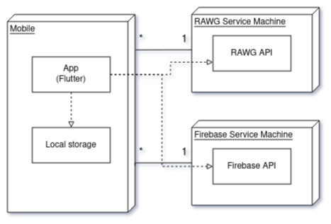

## Architecture and Design
The architecture of a software system encompasses the set of key decisions about its overall organization. 

A well written architecture document is brief but reduces the amount of time it takes new programmers to a project to understand the code to feel able to make modifications and enhancements.

To document the architecture requires describing the decomposition of the system in their parts (high-level components) and the key behaviors and collaborations between them. 

In this section you should start by briefly describing the overall components of the project and their interrelations. You should also describe how you solved typical problems you may have encountered, pointing to well-known architectural and design patterns, if applicable.

### Logical architecture
For our project we chose a layered architecture, where bottom layers give resources to the upper layers. It is composed by 3 layers, the User Interface, the Business Logic and the Models/Schemas.
This resembles the MVC architecture, however it is different because in this case the communication is linear, that is, the UI unit communicates with the Logical unit, which in turn communicates with the Schemas unit.
There also exists an external layer composed by the Rawg Api and the Firebase Api modules, which are used to receive data about games and saving data input by the users, respectively.

The User Interface unit is composed by two smaller units, the Screens and the Components.
The Screens are responsible for displaying information in the user screen, while the Components are the 'blocks' used to build each Screen. By having this separation we can reuse the singular, small components to build each Screen independently.

The Business Logic unit handles the 'back-end' logic of our app. It is responsible for receiving actions made by the user and the data received with those actions, processing that data and sending that data forward (in the architecture), which will then be displayed in the user Screen again.

The Database Schemas unit will hold models to store the information about the main entities in our app in an easy way. Because of that it will only be responsible for storing data in a structered way, as also being able to parse json objects into fields that make sense in our application.

### Physical architecture

Our product is a mobile application, so we can describe the physical architecture of the system in terms of the components that make up the system and how they are deployed.
We have the following components:
* Mobile App:
    The app is being developed in flutter, a cross-platform framework that allows us to develop for both Android and iOS. We will use the local storage to store user data such as the preference of dark/light mode.

* RAWG Service Machine: 
    In order to get the game information, we use the RAWG API, which is a REST API that provides information about games. There we get the information about the games, such as the name, the description, the images, the platforms, the genres, etc. We also use the RAWG API to get the list of games that match a search query.

* Firebase Service Machine:
    We use Firebase API in order to store the user's data, such as name, email and password and the reviews of each game and his likes and dislikes.      

### Vertical prototype

In our vertical prototype we developed several simple features:

- **Navigation bar**: We developed a simple navigation bar in the bottom of the screen that allows the user to navigate between three pages.

- **Light/Dark mode**: We styled each component to have a light mode and a dark mode design that changes by tapping the button on the top right corner. In the project we will be implementing this feature in a better way since, in this prototype, we didn't take full advantage of the ThemeData in the MaterialApp (by using theme.of(context)).

- **User authentication**: We developed a simple Login/Register page in which the user can create an account and log into the app. The user is logged in the user page shows a sign out button with the email of the user. If he isn't logged in the page shows a sign in button the redirects to the login/register form. The form isn't fully operatable since it always redirects the user to the home page if the submit button is tapped. However, if the user didn't type valid credentials, they won't be logged in.

- **Using the API**: We have explored the endpoints of the RAWG API that we intend to use in this project: the get all games endpoint that takes as optional parameters the number of games it returns, the page it returns (if the number of games it returns is 10, if we specify the page as 1 it will return the first 10 games. If we specify the page as 2 it will return the 11th to the 20th game...), the search query (being search query "Mario", it would return games that have a similar name to Mario), and the genres. To explore the API's functionality we developed a service that calls the endpoint and a model that parses the json that is returned. To parse the json we used the http package.

- **Env file**: We created a simple .env file that stores the key to the RAWG API and the base url for the API calls, not making it public to the people that want to read the source files.

- **Flutter**: We explored a lot of components from Flutter UI core and the Material UI package such as: Text, Column, Row, SizedBox, ListView, Expanded, Icon, Container, MaterialApp, InkWell, Scaffold, AppBar, BottomNavigationBar, Padding, MaterialPageRoute, Center, Align, StreamBuilder and BoxDecoration.

- **Firebase Database**: We explored the surface of the Firebase's realtime database by writing and reading to the database. Although we got it to work in a session, for some reason that we are still trying to figure out, the changes don't reflect in the Firebase's console. Because of that, all data written is lost when the user exits the application. We ill be looking further into that when developing the final product. 

