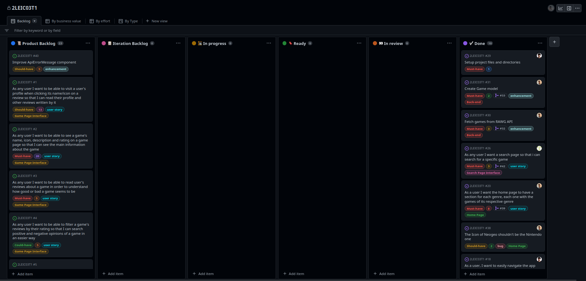
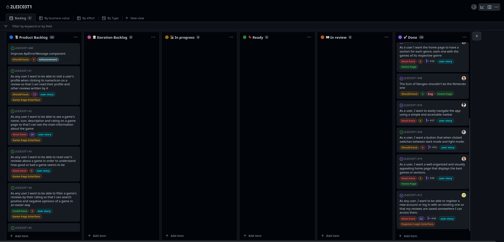
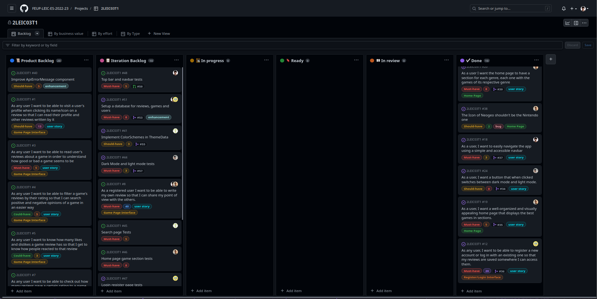
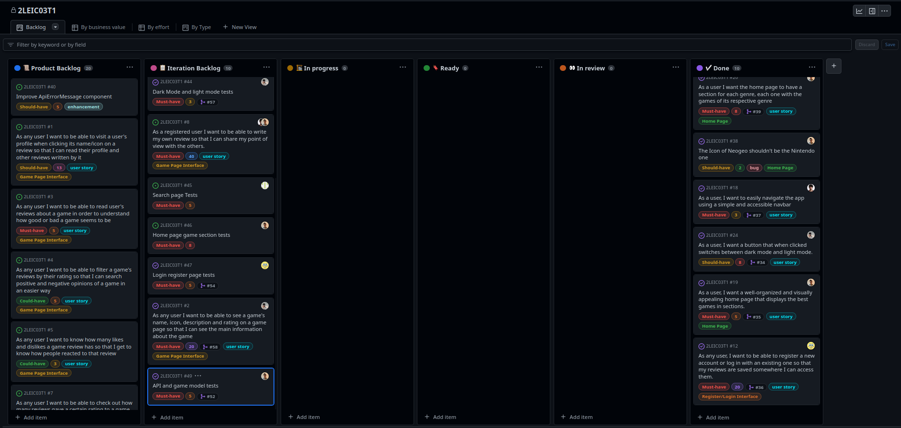
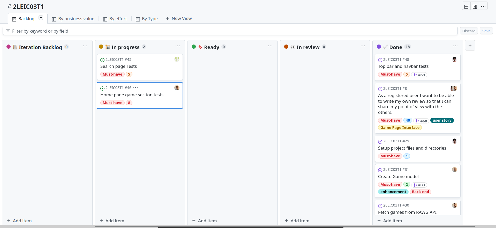
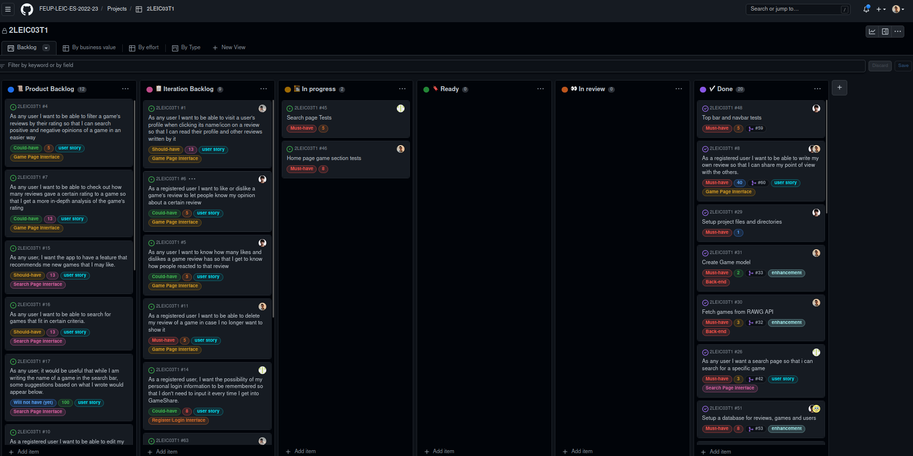
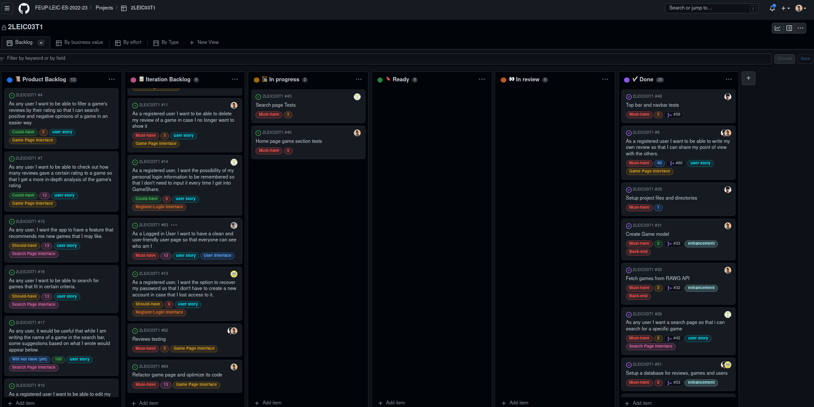
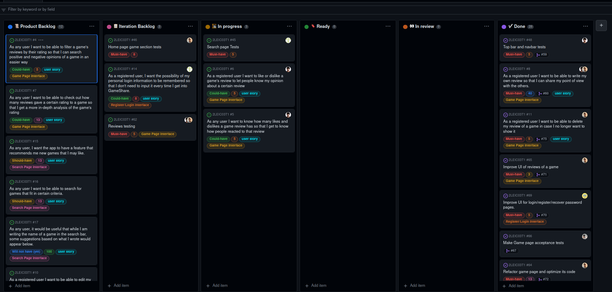
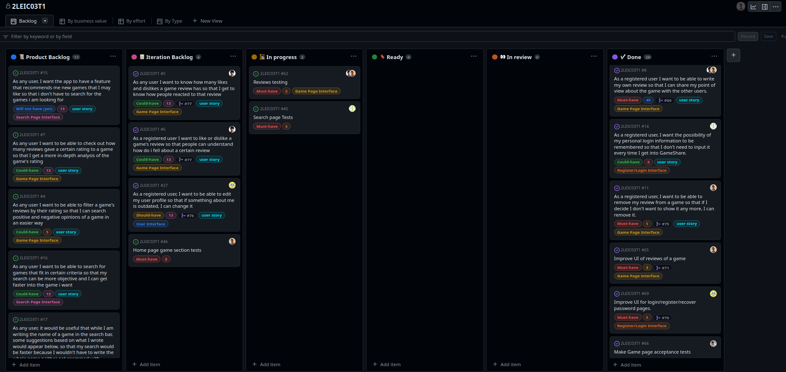
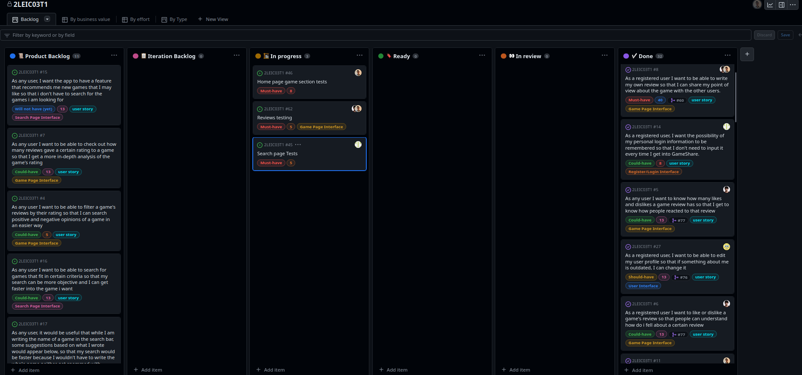

# Project management

# First Iteration

## Start of the iteration

---
## End of the iteration

First Page           |  Second Page
:-------------------------:|:-------------------------:
  |  

---
 

# The Four Questions:

### <b>What went well?</b>
- We were able to finish all the planned issues for the iteration.
- We finally managed to work with firebase authentication service without problems.
- We were able to work with all the technologies we wanted to use for this iteration.
- We got the interface closer to the mockups.
- We managed to produce organized code and made code reviews.

---
### <b>What didn't go so well?</b>
- We got some awkward commits and some problems when working with many people in the same issue.
- It was hard to start working with some flutter widgets and its specifications e.g. ListView's height and width constraints.
- The infinite scrolling on the Search Page gave us some problems.
- It was difficult to understand how to update a stateful widget within another stateful widget.
- We didn't have time to improve on the things that didn't go so well on iteration 0.

---
### <b>What have we learned?</b>
- We learned how to work with API's. 
- We learned how to work with providers in flutter.
- We learned how to use the ThemeData.
- We learned how to use the Navigator.
- We learned how to plan an iteration.
- We learned how to use the firebase authentication service.
- We learned how to protect the main branch of a repository.

---
### <b>What still puzzles us?</b>
- We still haven't figured out how to use the firebase realtime database.
- Some details in flutter are still confusing. 
- It's difficult to know how a widget updates other widgets with state.
- It's confusing to know how we should organize the code i.e. which widgets should we extract as another component.

---
 

# Second Iteration

## Start of the iteration

First Page           |  Second Page
:-------------------------:|:-------------------------:
  |  

---
## End of the iteration

---
 

# The Four Questions:

### <b>What went well?</b>
- We managed to make one of the most important pages for our app - the game page! 
- We finally got the database to work.
- We started testing the majority of the components we had created.

---
### <b>What didn't go so well?</b>
- Gherkin tests were hard to write.
- We shouldn't have planned to do so much since we knew we had two busy weeks ahead of us.

---
### <b>What have we learned?</b>
- We know how to develop unit tests and the basics of Gherkin tests.
- We managed to learn how to use the database although some more digging is needed.
- We learned how to use the Form widget in flutter and how to create custom FormFields.
- We feel a bit more proficient in Flutter overall.
- We learned how to use the mockito package.

---
### <b>What still puzzles us?</b>
- We still haven't grasped all the details about acceptance tests with Gherkin.
- We still don't know how to move between pages effectivily in Gherkin tests.
- We aren't sure if fetching data from the cloud firestore should be an asynchronous action or not.

---
 

# Third Iteration

## Start of the iteration

First Page           |  Second Page
:-------------------------:|:-------------------------:
  |  

---
## End of the iteration

---
 

# The Four Questions:

### <b>What went well?</b>
- We have a very important new page: the user page! 
- The user can now delete a review he previously wrote
- We added a feature to recover the password through email.
- Fixed some bugs with reviews not appearing and text overflow bugs
- Any user can go to a user's page by tapping on his email on one of his reviews
- A user can go to a game page by tapping the name of the game on a user's review
- Updated the reviews UI

---
### <b>What didn't go so well?</b>
- We had trouble making the game page smoother.
- We refactored the login and register pages and we had some problems with updating the error message shown.
- We had trouble with mocking the CachedNetworkImage widget as it doesn't let us run widget tests due to its http calls which hindered our progress.
- Dealing with Cloud Firestore's mockups wasn't an easy task.

---
### <b>What have we learned?</b>
- We learned how to use firebase to recover the password through email.
- We found an alternative to FutureBuilder which makes UX better.
- We got more familiar with the cloud firestore service (because of the user functionality / reviews).
- We once again mocked some services to test the UI.
- We got better at managing state in flutter

---
### <b>What still puzzles us?</b>
- We still don't know how to separate the page navigation logic from the nav_bar, and that causes some trouble.
- We still haven't figured out how to mock the CachedNetworkImage widget functionality
- Dealing with Cloud FIrestore's mocks still isn't trivial.

---
 

# Fourth Iteration

## Start of the iteration

 

---
## End of the iteration

---
 

# The Four Questions:

### <b>What went well?</b>
- We have completed the game page, which is one of the most important pages of the app.
- We managed to make most of the new features, even with a lot of other projects ongoing.

---
### <b>What didn't go so well?</b>
- We coulnd't finish all the tests we wanted to do because we prioritized the features.
- Other projects took a lot of time from this one, so we couldn't do as much as we wanted.

---
### <b>What have we learned?</b>
- We understand how to use the cloud firestore service better.
- We had contact with LocalStorage and we understand how to use it.

---
### <b>What still puzzles us?</b>
- We had some trouble with the tests, so we still don't know how to test some of the widgets we have.

---
 

