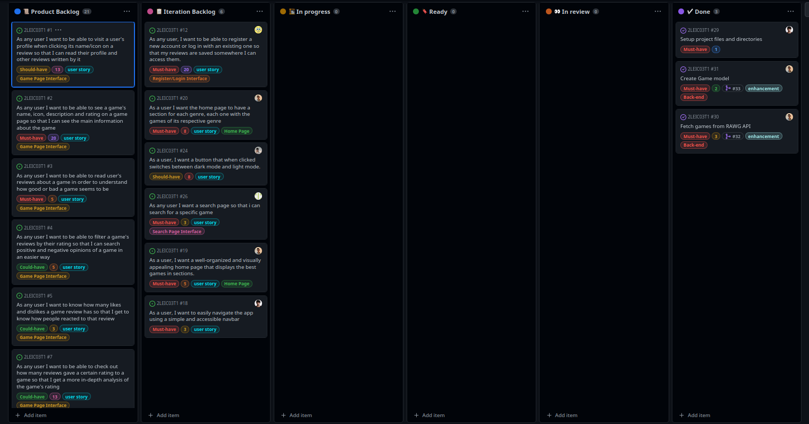

# Project management

# First Iteration

## Start of the iteration

---
## End of the iteration

First Page           |  Second Page
:-------------------------:|:-------------------------:
  |  

---
 

# The Four Questions:

### <b>What went well?</b>
- We were able to finish all the planned issues for the iteration.
- We finally managed to work with firebase authentication service without problems.
- We were able to work with all the technologies we wanted to use for this iteration.
- We got the interface closer to the mockups.
- We managed to produce organized code and made code reviews.

---
### <b>What didn't go so well?</b>
- We got some awkward commits and some problems when working with many people in the same issue.
- It was hard to start working with some flutter widgets and its specifications e.g. ListView's height and width constraints.
- The infinite scrolling on the Search Page gave us some problems.
- It was difficult to understand how to update a stateful widget within another stateful widget.
- We didn't have time to improve on the things that didn't go so well on iteration 0.

---
### <b>What have we learned?</b>
- We learned how to work with API's. 
- We learned how to work with providers in flutter.
- We learned how to use the ThemeData.
- We learned how to use the Navigator.
- We learned how to plan an iteration.
- We learned how to use the firebase authentication service.
- We learned how to protect the main branch of a repository.

---
### <b>What still puzzles us?</b>
- We still haven't figured out how to use the firebase realtime database.
- Some details in flutter are still confusing. 
- It's difficult to know how a widget updates other widgets with state.
- It's confusing to know how we should organize the code i.e. which widgets should we extract as another component.

---
 

# Second Iteration

## Start of the iteration

First Page           |  Second Page
:-------------------------:|:-------------------------:
  |  

---
## End of the iteration

---
 

# The Four Questions:

### <b>What went well?</b>
- We managed to make one of the most important pages for our app - the game page! 
- We finally got the database to work.
- We started testing the majority of the components we had created.

---
### <b>What didn't go so well?</b>
- Gherkin tests were hard to write.
- We shouldn't have planned to do so much since we knew we had two busy weeks ahead of us.

---
### <b>What have we learned?</b>
- We know how to develop unit tests and the basics of Gherkin tests.
- We managed to learn how to use the database although some more digging is needed.
- We learned how to use the Form widget in flutter and how to create custom FormFields.
- We feel a bit more proficient in Flutter overall.
- We learned how to use the mockito package.

---
### <b>What still puzzles us?</b>
- We still haven't grasped all the details about acceptance tests with Gherkin.
- We still don't know how to move between pages effectivily in Gherkin tests.
- We aren't sure if fetching data from the cloud firestore should be an asynchronous action or not.

---
 
